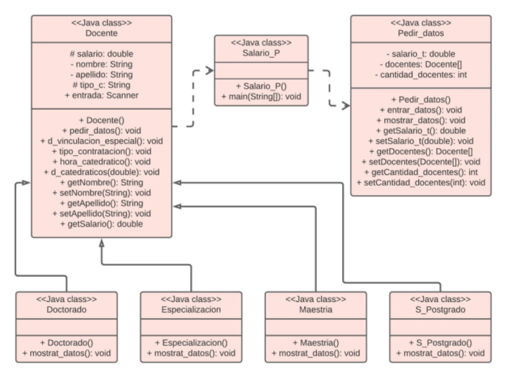

# Principios de diseño
En este repositorio se encuentra un código sencillo, con su respectivo diagrama de clases, donde se pretende reflejar el buen uso de algunos de los principios de diseño más comunes, entre los cuales se encuentran los siguientes:

1. Principio de responsabilidad simple.
1. Principio KISS, Keep it Simple and Stupid.
1. Principio abierto-cerrado.
1. Principio de sustitución de Liskov
1. Principio del menor conocimiento, Ley de Demeter.

**Diagrama de clases**

