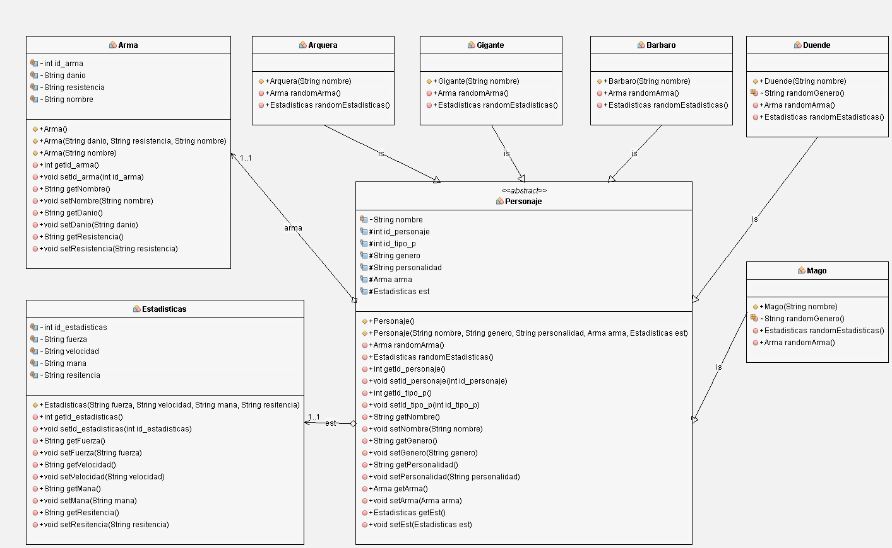

# Personajes con patron de diseño
En este repositorio se encuentra un código encargado de solicitar al usuario una clase de personaje (barbaro, duende, mago, etc) y una cantidad de éstos que desee crear, a lo que el código devolvera los personajes creados con caracteristicas y estadisticas aleatorias específicas para cada uno de estos con su respectiva imagen.

Las clases de personajes son las siguientes:
1. Barbaro.
1. Arquera.
1. Duende.
1. Gigante.
1. Mago.

**Diagrama de clases**

