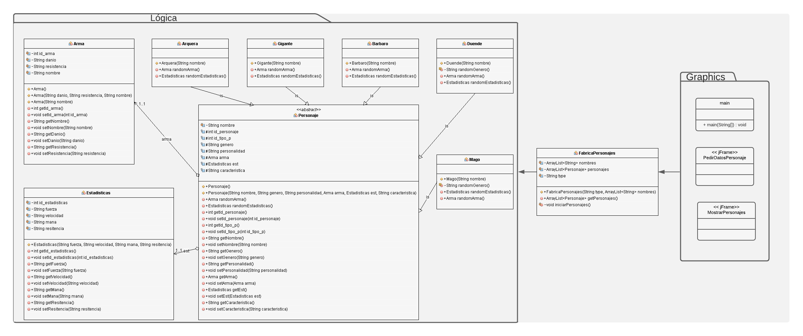

# Personajes con patron de diseño
En este repositorio se encuentra un código encargado de solicitar al usuario una clase de personaje (barbaro, duende, mago, etc) y una cantidad de éstos que desee crear, a lo que el código devolvera los personajes creados con caracteristicas y estadisticas aleatorias específicas para cada uno de estos con su respectiva imagen.

El patron de diseño utilizado en este proyecto es Factory Method, debido a que se necesita crear objetos de una superclase, pero permitiendo que las subclases cambien caracteristicas del objeto, en este caso la superclase es personaje, y las subclases lo modifican para que sea del tipo que desee el usuario (barbaro, duende, etc.).

En este proyecto no se utilizaron los siguientes patrones:
1. Abstract Factory, ya que mezclarlo con el Factory Method podría producir problemas.
1. Prototype, debido a que no nos sirve clonar los objetos ya que asignamos las caracteristicas del personaje de manera aleatoria para cada uno.
1. Singleton, porque no se necesita que exista una única instancia ni un único punto de acceso a la superclase.

**Diagrama de clases**

