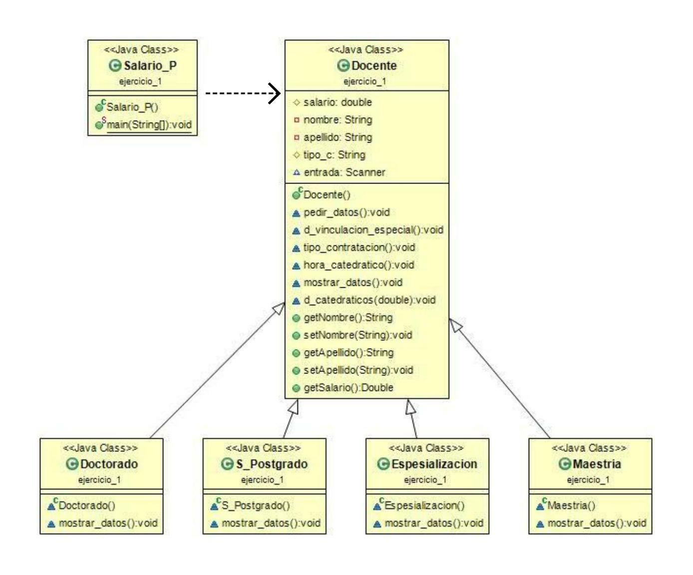

# Modelos de programación I

## Instalación o ejecución de los programas
Todos los proyectos alojados en este repositorio estan realizados con el IDE NetBeans, por ende, cualquier proyecto puede ser ejecutado mediante el IDE en cuestion o por cualqueier otro que permita y reconozca la estructura de los proyectos generados por NetBeans.

## Estudiantes
1. Laura Andrea Riobueno Rincón - 20201020040.
1. Camilo Andres Garcia Zambrano - 20201020047.

# Proyectos
- [Proyecto 1: Principios de diseño](./Actividad_principios/Docente)

# Principios de diseño
En este repositorio se encuentra un código sencillo, con su respectivo diagrama de clases, donde se pretende reflejar el buen uso de algunos de los principios de diseño más comunes, entre los cuales se encuentran los siguientes:

1. Principio de responsabilidad simple.
1. Principio KISS, Keep it Simple and Stupid.
1. Principio abierto-cerrado.
1. Principio de sustitución de Liskov
1. Principio del menor conocimiento, Ley de Demeter.

[Codigo del repositorio!](./Actividad_principios/Docente)

**Diagrama de clases**

